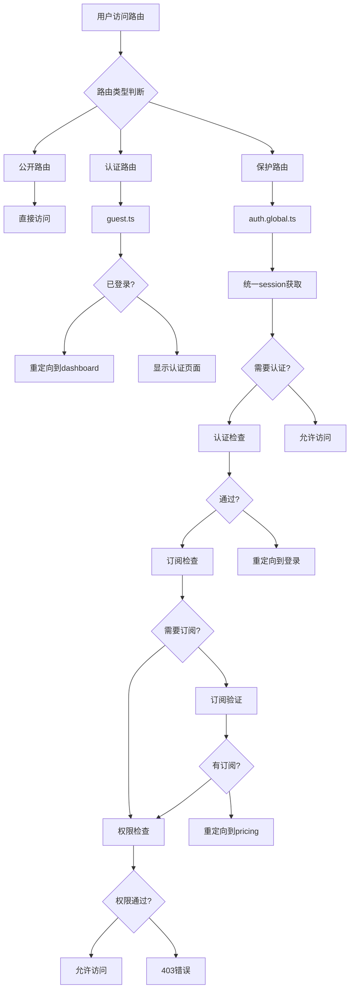
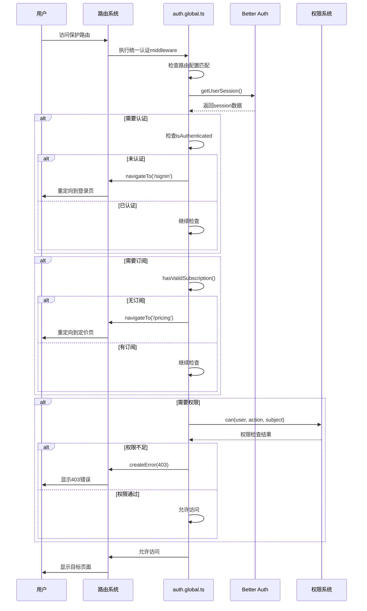

# Nuxt Unified Authentication System Documentation

## 概述

本文档详细说明了ShipEasy Nuxt应用中的**统一认证系统**架构和验证流程。

## 设计理念 ✨

- 🎯 **统一处理**: 一个middleware处理所有认证场景
- 🔧 **配置驱动**: 通过配置数组管理路由保护
- 🚀 **简单易用**: 减少认知负担和维护成本
- 📝 **易于扩展**: 添加新路由只需修改配置

## 架构概述



## 文件结构

```
apps/nuxt-app/middleware/
├── auth.global.ts          # 🔒 统一认证middleware (核心)
├── auth.ts                 # 🔐 简单认证middleware (可选)
├── guest.ts                # 👤 访客middleware (登录页面)
└── locale.global.ts        # 🌍 国际化middleware
```

## 核心组件

### 1. 统一认证middleware (auth.global.ts)

**职责**: 
- ✅ 认证检查 (用户是否登录)
- ✅ 权限验证 (RBAC基于角色的访问控制)
- ✅ 订阅验证 (付费功能检查)
- ✅ 路由保护 (统一配置管理)

**技术栈**:
- `authClientVue.getSession()` - Better Auth会话管理
- `createAppUser()` + `can()` - RBAC权限系统
- 配置驱动的路由保护

### 2. 路由配置系统

```typescript
interface ProtectedRouteConfig {
  pattern: RegExp              // 路由匹配模式
  type: 'page' | 'api'        // 路由类型
  requiresAuth?: boolean      // 是否需要认证
  requiredPermission?: {      // 需要的权限
    action: Action
    subject: Subject
  }
  requiresSubscription?: boolean // 是否需要订阅
}
```

### 3. 保护路由配置

```typescript
const protectedRoutes: ProtectedRouteConfig[] = [
  // 管理员路由 - 需要admin权限
  {
    pattern: /^\/admin(\/.*)?$/,
    type: 'page',
    requiresAuth: true,
    requiredPermission: { action: Action.MANAGE, subject: Subject.ALL }
  },
  
  // 普通用户页面 - 仅需认证
  {
    pattern: /^\/dashboard(\/.*)?$/,
    type: 'page',
    requiresAuth: true
  },
  
  // 高级功能 - 需要订阅
  {
    pattern: /^\/premium-features(\/.*)?$/,
    type: 'page',
    requiresAuth: true,
    requiresSubscription: true
  }
]
```

## 认证流程详解

### 1. 路由访问流程



### 2. 验证步骤

1. **路由匹配** - 检查当前路由是否在保护列表中
2. **认证检查** - 验证用户是否已登录
3. **订阅检查** - 验证是否有有效订阅 (如需要)
4. **权限检查** - 验证用户是否有足够权限 (如需要)
5. **访问授权** - 允许访问或返回错误

## 路由分类

### 🟢 公开路由 (无保护)
```
/ - 首页
/pricing - 定价页面
```

### 🔵 认证路由 (guest middleware)
```
/signin - 登录
/signup - 注册  
/forgot-password - 忘记密码
/reset-password - 重置密码
/cellphone - 手机验证
/wechat - 微信登录
```

### 🟡 保护路由 (auth.global.ts 自动处理)

#### 仅需认证
```
/dashboard - 用户仪表板
/settings - 设置
/ai - AI功能
```

#### 需要订阅
```
/premium-features - 高级功能
/api/premium/* - 高级API
```

#### 需要管理员权限
```
/admin/* - 所有管理员页面
/api/admin/* - 管理员API
```

## 📋 添加新路由指南

### 场景1: 添加公开路由

**无需任何配置！** 公开路由会被自动跳过。

```typescript
// 示例: /about 页面
// 无需任何middleware配置，直接创建页面即可
```

### 场景2: 添加需要认证的路由

在 `auth.global.ts` 的 `protectedRoutes` 数组中添加配置：

```typescript
// 示例: 添加 /profile 页面
{
  pattern: /^\/profile(\/.*)?$/,
  type: 'page',
  requiresAuth: true
}
```

### 场景3: 添加需要订阅的路由

```typescript
// 示例: 添加 /advanced-analytics 页面
{
  pattern: /^\/advanced-analytics(\/.*)?$/,
  type: 'page',
  requiresAuth: true,
  requiresSubscription: true
}
```

### 场景4: 添加需要特定权限的路由

```typescript
// 示例: 添加 /admin/reports 页面
{
  pattern: /^\/admin\/reports(\/.*)?$/,
  type: 'page',
  requiresAuth: true,
  requiredPermission: { action: Action.READ, subject: Subject.REPORT }
}
```

### 场景5: 添加API路由

```typescript
// 示例: 添加 /api/analytics API
{
  pattern: /^\/api\/analytics(\/.*)?$/,
  type: 'api',
  requiresAuth: true,
  requiresSubscription: true
}
```

### 场景6: 添加访客专用页面

在页面中使用 `guest` middleware：

```typescript
// 示例: /welcome 页面 (仅未登录用户)
definePageMeta({
  middleware: 'guest'
})
```

## 🔧 配置说明

### 路由模式说明

```typescript
// 精确匹配
pattern: /^\/dashboard$/          // 只匹配 /dashboard

// 匹配子路径  
pattern: /^\/admin(\/.*)?$/       // 匹配 /admin, /admin/users, /admin/settings 等

// API路由匹配
pattern: /^\/api\/admin\/(.*)?$/  // 匹配 /api/admin/* 下所有路由
```

### 权限配置示例

```typescript
// 管理员权限 (所有操作)
requiredPermission: { action: Action.MANAGE, subject: Subject.ALL }

// 读取权限 (特定资源)
requiredPermission: { action: Action.READ, subject: Subject.USER }

// 写入权限 (特定资源)  
requiredPermission: { action: Action.WRITE, subject: Subject.ORDER }
```

## 🔍 故障排除

### 常见问题

❌ **问题**: 访问管理员页面跳转到登录
✅ **解决**: 检查用户是否有 `admin` 角色和 `MANAGE:ALL` 权限

❌ **问题**: 付费功能无法访问
✅ **解决**: 检查 `hasValidSubscription()` 函数实现

❌ **问题**: 新添加的路由没有保护
✅ **解决**: 确认路由配置已添加到 `protectedRoutes` 数组

### 调试技巧

1. **查看控制台日志**
```bash
🔒 Protected route accessed: /admin/users (Type: page)
💳 Checking subscription for: /premium-features, User: 123
🛡️ Checking permissions for: /admin (MANAGE:ALL)
✅ Access granted to: /admin for user: 123
```

2. **验证session状态**
```typescript
const { user, isAuthenticated } = await getUserSession()
console.log('Auth status:', { user: user?.id, isAuthenticated })
```

3. **检查权限配置**
```typescript
const appUser = createAppUser(user)
console.log('User permissions:', can(appUser, Action.MANAGE, Subject.ALL))
```

## 📊 性能优化

1. **统一session获取** - 避免重复调用 `getSession()`
2. **缓存权限检查** - 在同一请求中复用权限结果
3. **最小化检查** - 只在需要时进行复杂验证

## 🚀 最佳实践

### DO ✅
- 使用配置驱动的路由保护
- 为新路由添加适当的配置
- 使用描述性的日志信息
- 统一错误处理

### DON'T ❌
- 在页面中手动应用 `middleware: 'admin'` (已自动处理)
- 创建重复的认证逻辑
- 硬编码权限检查
- 忽略错误处理

## 更新历史

- **2024-01**: 初始版本，多个分离的middleware
- **2024-01**: 重构为统一认证系统
- **2024-01**: 添加配置驱动的路由保护
- **2024-01**: 完善文档和添加指南

---

## 🎯 总结

新的统一认证系统具有以下优势：

- 🎯 **简单**: 只需要理解一个核心middleware
- 🔧 **灵活**: 配置驱动，易于扩展
- 🚀 **高效**: 统一的session管理，避免重复调用
- 📝 **可维护**: 所有认证逻辑集中在一个地方
- 🛡️ **安全**: 统一的错误处理和权限检查

*此文档提供完整的系统说明和实用指南* 